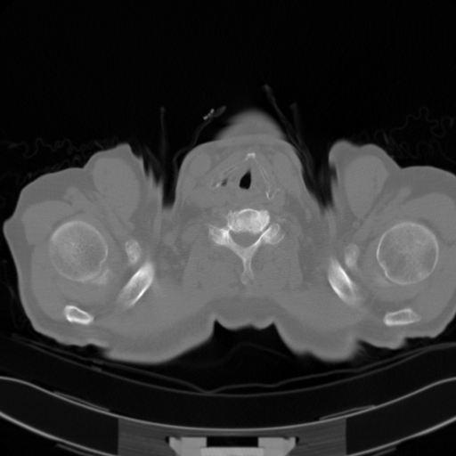
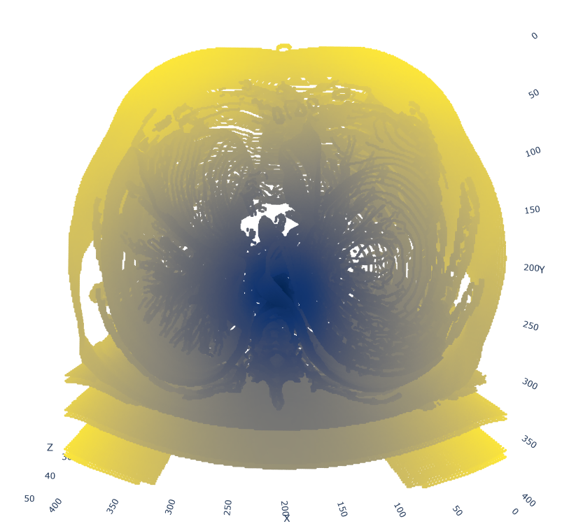
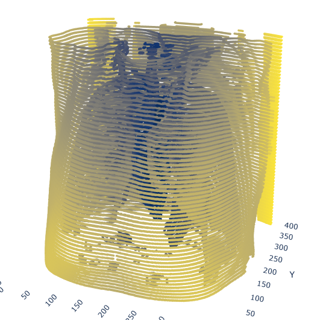
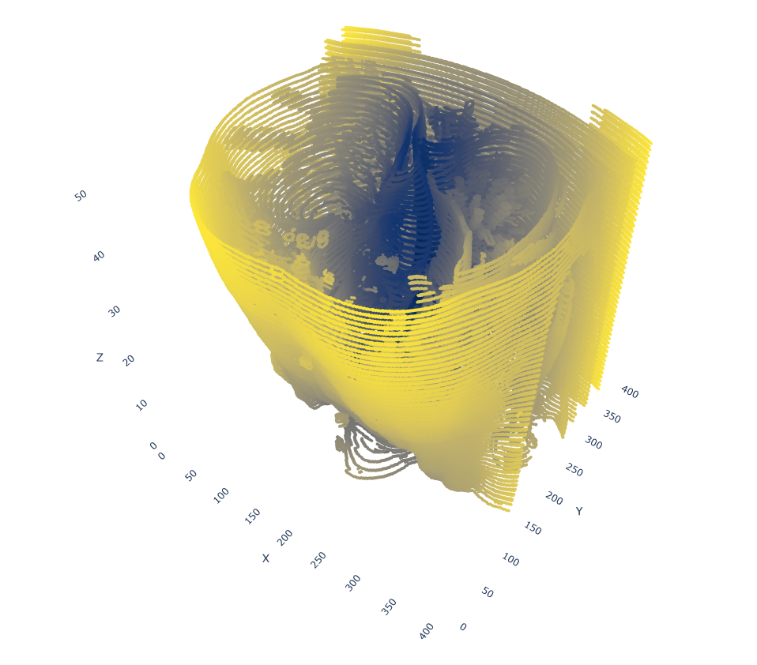
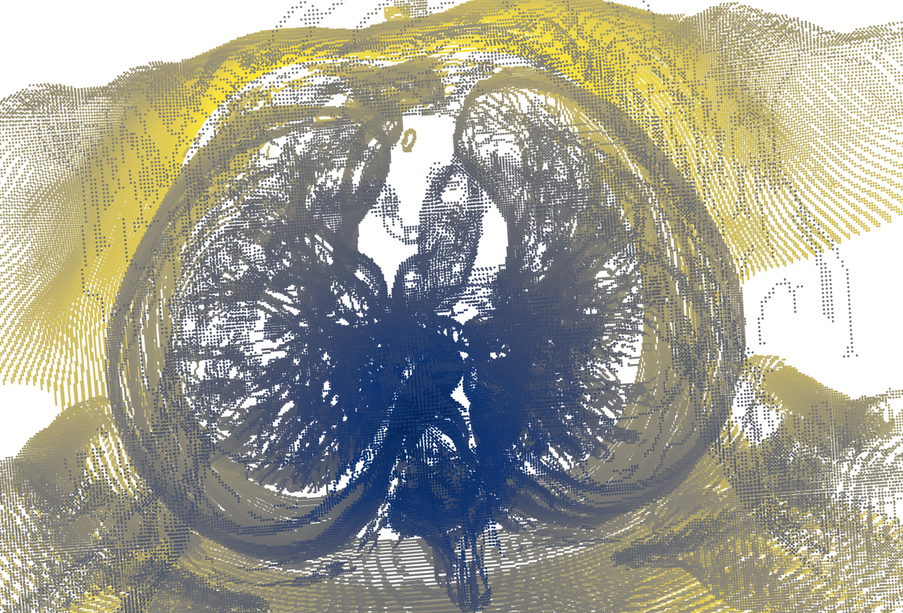

##  Detecting contours of human organs in 3D CT images using the Canny edge detector

This repository contains files for detecting contours of human organs in 3D CT images using the Canny edge detector.

The repository consists of the following files:
- `complete_ct_contour_reconstruction.py contains code for fulfilling the task. It receives the path to a folder with CT images and displays the original images along with the edges, pre and post 24 connectivity algorithm. 
- `canny_.py` contains implementation of the canny edge detector
- `canny.ipynb` contains development code for the canny detector implementation and shows threshold selection based on similarity of images returned by our implementation and the cv2.Canny() funciton.
- `detect_edges_all.ipynb` contains code for edge detection on the entire database

Other files:
- `visualize.ipynb` generates a 3D point cloud visualization using matplotlib.
- `visualize_interactively.py` generates an interactable 3D scatter plot of the pointcloud, with 24 point connectivity in the browser.
- `visualize_stacked.py` generates an interactable 3D scatter plot of the pointcloud with stacked edges and no 24 point connectivity.
- `vis.py` is a demo for when you don't have access to data and displays precomputed pointcloud, saved in `pc.npy`.
- `compare_algorithms.ipynb` computes the pixel match ratio between the python's detector and our detector.
The `report.pdf` explains the whole process in more detail.
To run the code, initialize a new environment (`venv`), activate it and install the required dependencies (`pip install -r requirements.txt`)

Visualization samples:

Example of input image: \

Examples of different pointclouds: \
 \

 \ 

 

